# Chapa Sirithunge

**Marie Sklodowska-Curie Fellow**  
Bio-Inspired Robotics Lab, University of Cambridge  |  [LinkedIn](https://www.linkedin.com/in/chapa-sirithunge/)  |  [Google Scholar](https://scholar.google.com/citations?user=72CpRjoAAAAJ&hl=en)  |  [GitHub](https://github.com/yourusername)  |  [Email](mailto:csh66@cam.ac.uk)

  

[About Me](#about-me) ⬩ 
[Research Interests](#research-interests) ⬩ 
[Projects](#projects) ⬩ 
[Publications](#publications) ⬩ 
[News](#news) ⬩ 
[Contact](#contact) 

---

## About Me

I am a Marie-Curie **postdoctoral fellow** specialising in **robotics** with a passion for **service robots  and human-centred design**. Currently based at **University of Cambridge**, I work on projects that integrate **multimodel sensing, morphological design of robots and embodied intelligence**, aiming to **develop robots which can serve a wider range of applications**.

---

## Research Interests

- **Embodied agents**: Robot design directly influences embodied agents by shaping their physical interactions, sensory processing, and adaptive behaviors, ultimately impacting their ability to learn from and respond to their environment effectively.
- **Human-centered systems**: To create human-centered robots, designers should integrate sensory capabilities and adaptive mechanisms that prioritize interpreting human cues, understanding environmental context, and responding with behaviors aligned with natural human interaction patterns.
- **Soft Robotics**: Soft robotics enhances these concepts by providing flexible, adaptive structures that better mimic human motion and tactile responsiveness, enabling more intuitive, safe, and effective interactions with people and environments.
- **Bio-inspired robots**: Bio-inspired robots achieve embodiment by replicating natural forms and adaptive behaviors, allowing them to navigate and interact within environments more organically and effectively, similar to living organisms.

---

## Projects

### Robopatient
Robopatient is a medical robotic simulator which investigates how human participants use haptic exploration behaviours to detect abnormalities in a soft tissue given palpation force constraints. Research around this platform focuses on  training medical students to perform physical examinations on patients under constraints imposed by pain expressions conditioned by different gender and culture backgrounds. Robopatient is currently capable of generating "pain" based on pain expressions such as facial expressions and pain sound based on palpation during diagnosis. I am using this robotic platform to study the embodied generation of pain expressions.

### Soft manipulation
The exceptional dexterity, adaptability, and sensory feedback of human and primate hands serve as a gold standard for developing soft robotic hands, inspiring designs that aim to replicate nuanced movements, grip versatility, and tactile precision for complex tasks.

### Simulation work
I am using multi-agent systems (MAS), information theory and machine learning to simulate context-aware models in complex environments.

### Robot building 
I love building robots! Here are some designs I developed for robots, human studies and exhibitions during the last two years.

 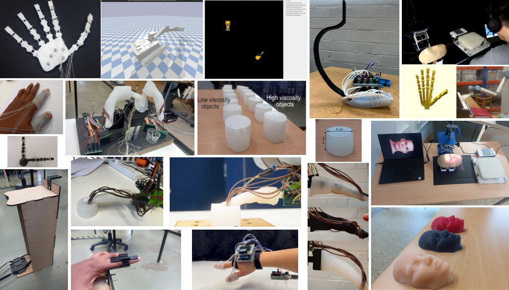
 

---

## Selecetd Publications

- **Effect of Material Viscosity on Tactile Compliance Discrimination** - *BioRob*, 2024 (Nominated for best paper award)
  Explores how varying viscosity levels in materials influence the ability of tactile sensors to discern compliance, or softness, during physical interaction. It emphasizes the role of material properties in enhancing robotic tactile perception, which is critical for fine-tuned, adaptive handling in tasks requiring sensitivity to texture and pliability.
  
- **Proactive Robots With the Perception of Nonverbal Human Behavior: A Review** - *IEEE ACCESS*, 2019  
  In this work, I explored how robots can interpret nonverbal human cues—such as gestures, facial expressions, and posture—to anticipate needs and act proactively in various interactions. It emphasizes advancements in machine learning and sensor technology that enable robots to achieve more natural, human-centered interactions through nuanced understanding of these behaviors. This is a highlight of my PhD work.  [Link to publication](https://ieeexplore.ieee.org/abstract/document/8734064/)

- **Enhancing Overall Object Placement by Understanding Uncertain Spatial and Qualitative Distance Information in User Commands** - *ICRA*, 2018  
  This work investigates methods for robots to interpret vague spatial language (e.g., "near," "close to") in user instructions, enabling more accurate object placement. It highlights techniques that allow robots to handle uncertainty in human language, improving their ability to meet user expectations in tasks requiring spatial awareness. [Link to publication](https://ieeexplore.ieee.org/abstract/document/8460624)

- **Situation Awareness for Proactive Robots in HRI** - *IROS*, 2019
  Examines how robots can develop situation awareness to anticipate human actions and intentions in Human-Robot Interaction (HRI). It focuses on enabling robots to assess context dynamically, enhancing proactive assistance and decision-making based on environmental cues and user behaviors.  [Link to publication](https://ieeexplore.ieee.org/abstract/document/8967821)
  
- **Check out the full set of publications here**: [Google Scholar](https://scholar.google.com/citations?user=72CpRjoAAAAJ&hl=en)
  
---

## News 
- **Fun evening playing chess with college members at Newnham College**: My colleague Liuba Dvinskikh organised a casual chess session with college members. I hadn’t played in about 14 years, so it was refreshing to return to the board—relaxing, engaging, and full of good company.

  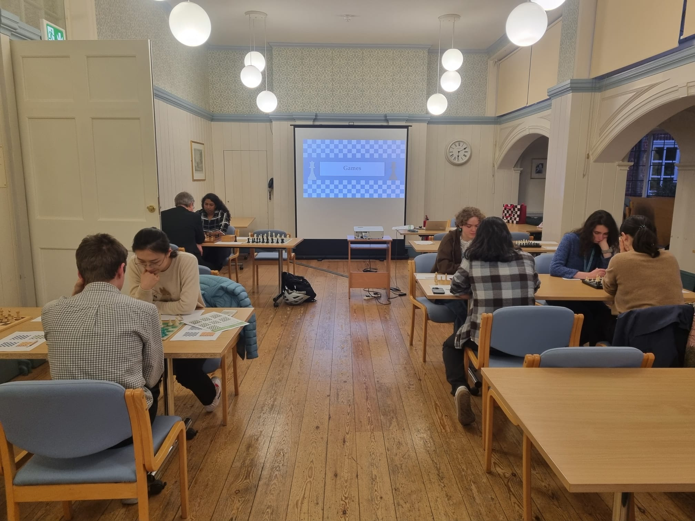

- **Robots showcase at Cambridge festival**: Cambridge women in robotics organised robots showcase event with the Cambridge festival on the 29th of March. This event was intended for general public, especially kids from age 10 upwards. Had a fun afternoon on 27.02.2025 at BBC Radio Cambridgeshire promoting this event coming up at the Cambridge Festival. I spoke to presenter Louise Holland about our motivations with this event, robot building and women in robotics Cambridge. 

  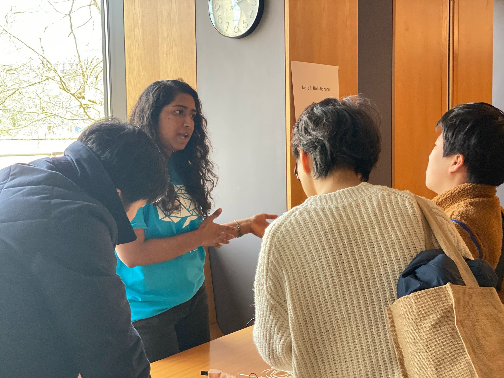
  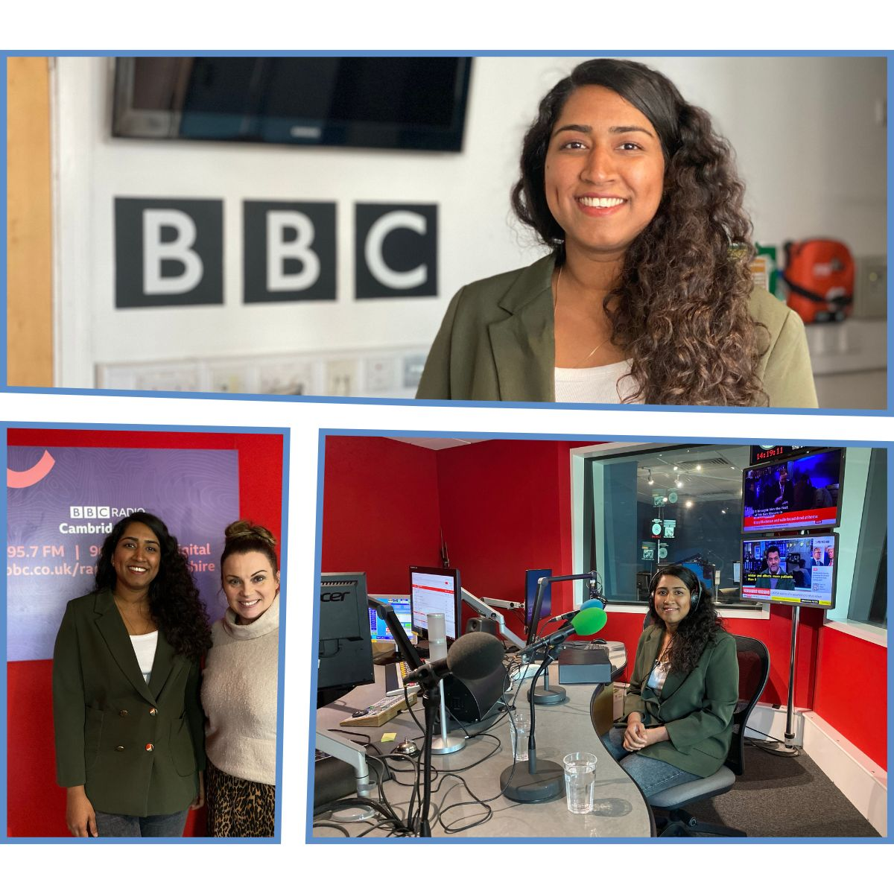
  
- **Talk at CUED BioEngineering Conference 2025**: I had the opportunity to present my work on "Synthetic Generation of Pain Expressions for Robopatients" at the Cambridge University Bioengineering Conference on Friday, 21 March 2025, held at St. Catherine’s College. It was my first time speaking to an audience comprised entirely of biology experts—an exciting shift in perspective. I hope the talk sparked some interesting cross-disciplinary discussions. It's always fascinating to see how robots still evoke more fear than familiarity for some! More details [here](https://www.eng.cam.ac.uk/research/academic-divisions/mechanics-materials-and-design/events).
    
- **Teaching in Cambridge**: This marks my third year teaching at the University of Cambridge. So far, I have delivered lectures on Soft Robotics, Human-Robot Interaction, and Machine Learning for Robotic Control. My teaching journey began during my second year as a PhD candidate at the University of Moratuwa. The experience gained, combined with the outcomes of my PhD, led to my appointment as a lecturer in Mechatronics at Sri Lanka Technological Campus, just eight months after my defense in December 2020. Through this journey, I have gained valuable insights into teaching methodologies, from preparing lecture materials to effectively engaging with students across a wide age range, from young undergraduates to professionals nearing retirement.

    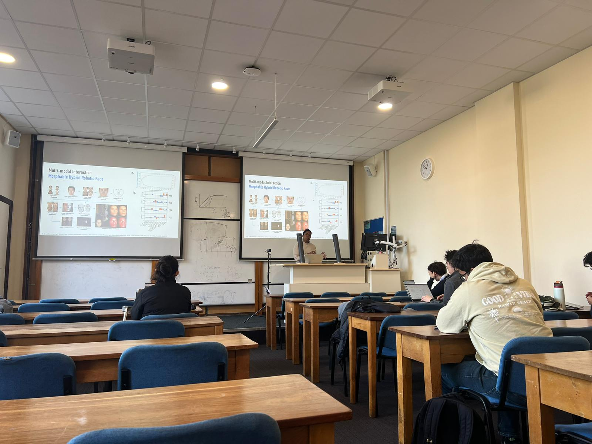
    
- **Robotics and Embodied Intelligence Workshop**: I organised the robotics and embodied intelligence workshop with the sponsorship of the Centre for Human-Inspired AI (CHIA) Cambrigde. This is the first sponsored event from Cambridge Women-in-Robotics. Full program can be found [here](https://www.chia.cam.ac.uk/events/women-in-robotics)

    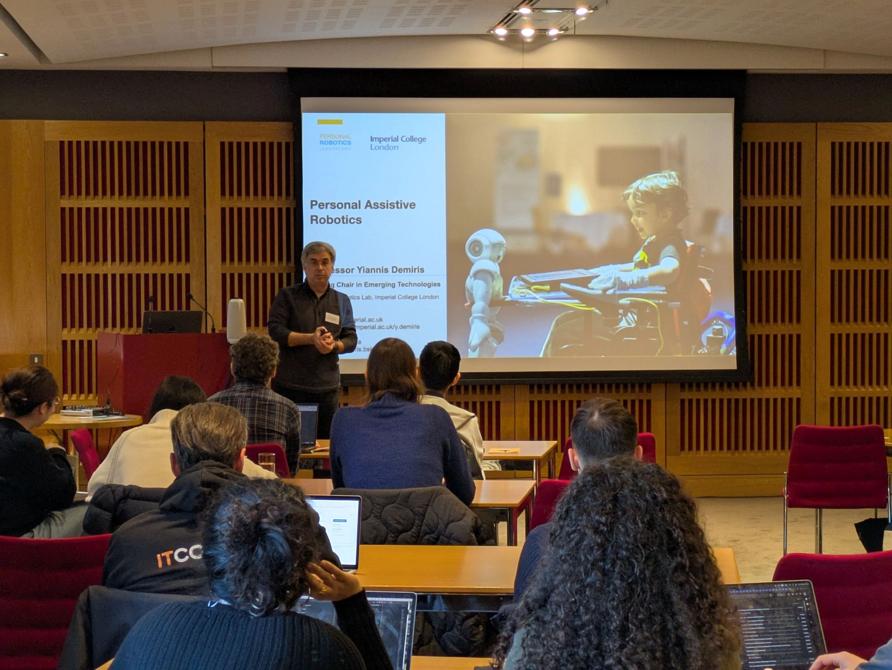
  
- **Co-chairing Embodied Intelligence online conference 2025**: This year marks the 5th time Prof. Fumiya Iida with the Bio-Inspired Robotics Lab is organising the online conference for discussing the past, present and future of embodied intelligence research. The conference will be held online 2-4 April 2025. Full program and registration can be found [here](embodied-intelligence.org)

  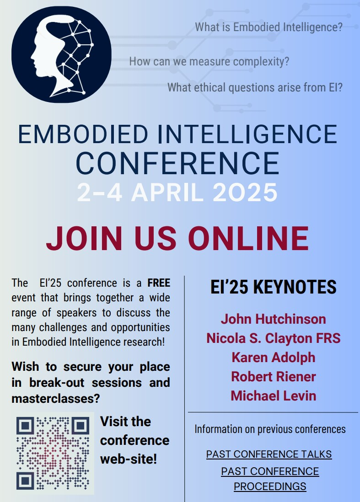

- **Presented at Digital Roads of the Future Annual Review 2024**: Presented a poster on my research on "Multi-Agent Systems on Machine Safety in Complex Environments". The event was held at Cambridge Union Society on the 13th November. The event hosted all the PIs, academic supervisors, industry partners, research fellows of the Digital Roads of Future program and potential investors. [Details](https://www.linkedin.com/posts/digital-roads-of-the-future-drf_msca-digitalroads-innovation-activity-7262870274646134786-lS8x?utm_source=share&utm_medium=member_desktop)

    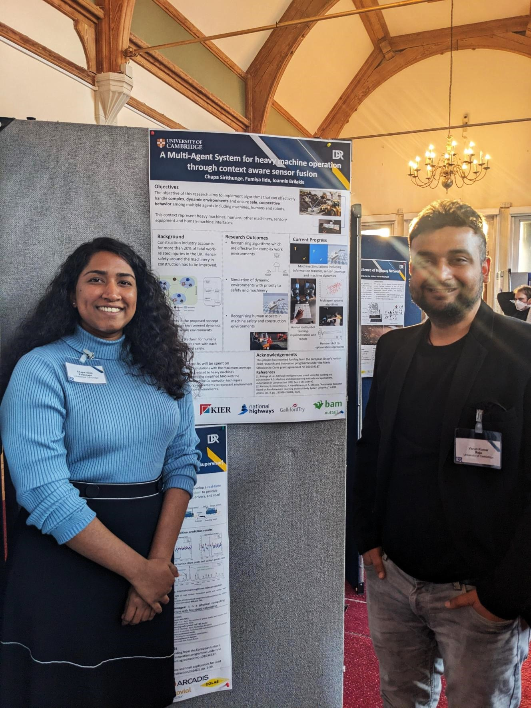

- **Talk on robotics**: Excited to share that gave a talk titled "Navigating the Physical World: The Essential Role of Robots" at  the kick off **pudding seminar** of Michaelmas term at Newnham College, Cambridge on the 11th of **October**. [Details](https://newn.cam.ac.uk/newnham-news/how-earthworms-and-plants-inspire-scientists-creating-robots)

    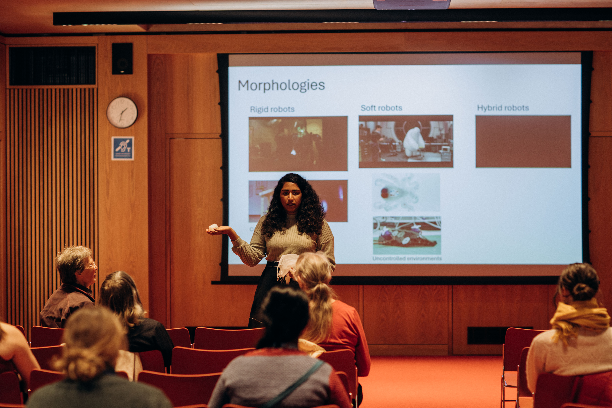

- **Robotics Workshop**:  I conducted the "Enhancing Women's Participation in Robotics" workshop and showcased robots with my team at the GLOBALWIIN 2024 Conference on the 3rd of **October** 2024. I'm proud to share that this marks our second event since founding the Women-in-Robotics Support Network for female roboticists.

    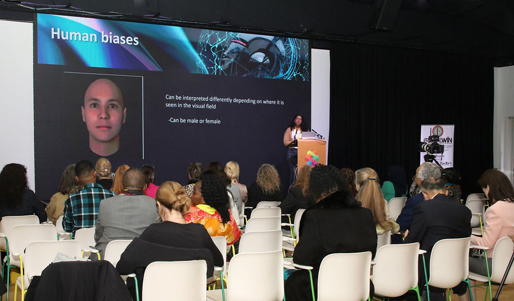

- **Award during postdoc appreciation week**: It was fascinating to be selected as a winner of the "Heroines of Science" award. This recognition is an incredible opportunity to share my journey through life and science, and I hope to inspire the next generation of young minds. [Find more](https://www.postdocacademy.cam.ac.uk/news/heroines-science-winners)

    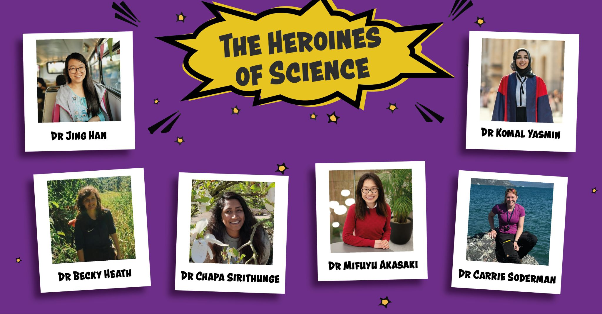

- **Robotics Workshop**: I conducted the "Women-in-Robotics" workshop at the AgriForwards CDT Conference 2024 on October 22nd, attracting over 25 participants, including male and female engineers and academic staff. It was fascinating to see recent statistics showing that men support this approach more than ever before in history.

    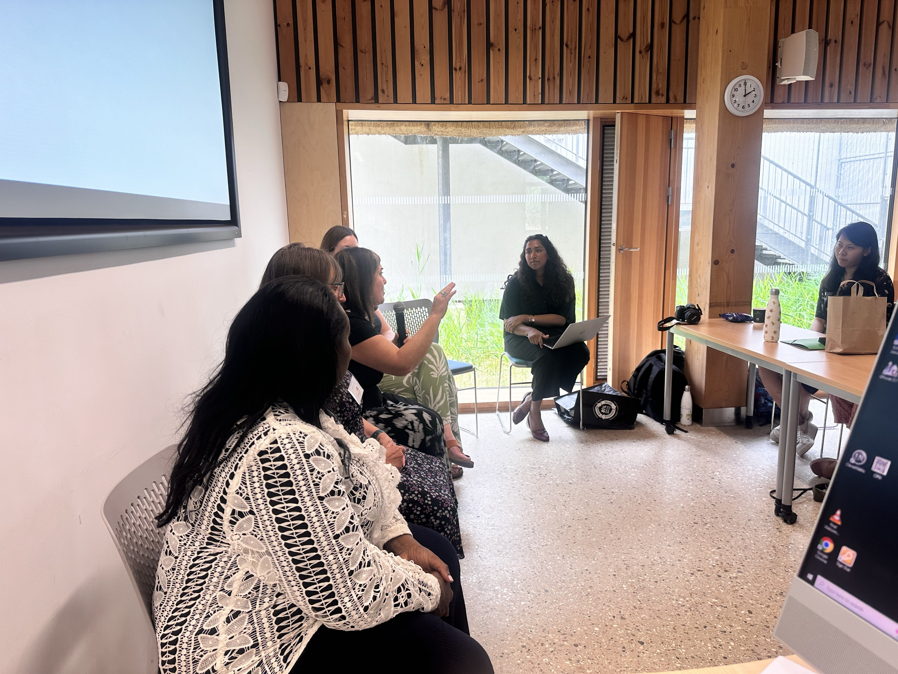

- **Women-in-robotics**: With the growing number of female researchers and staff at the University of Cambridge, I am delighted to announce that we have established the Women-in-Robotics Support Network, and I am honored to lead the team. If you're interested in our activities or curious to support, sign up [here](https://forms.office.com/e/aTcDGvujNu)
  
- **Lecture in Technical Training**: I gave an introductory talk on Soft Robotics for the new colleagues joing Future Roads program under Automation & Robotics theme for MSCA Cohort 3 Fellows and Industry partners.

   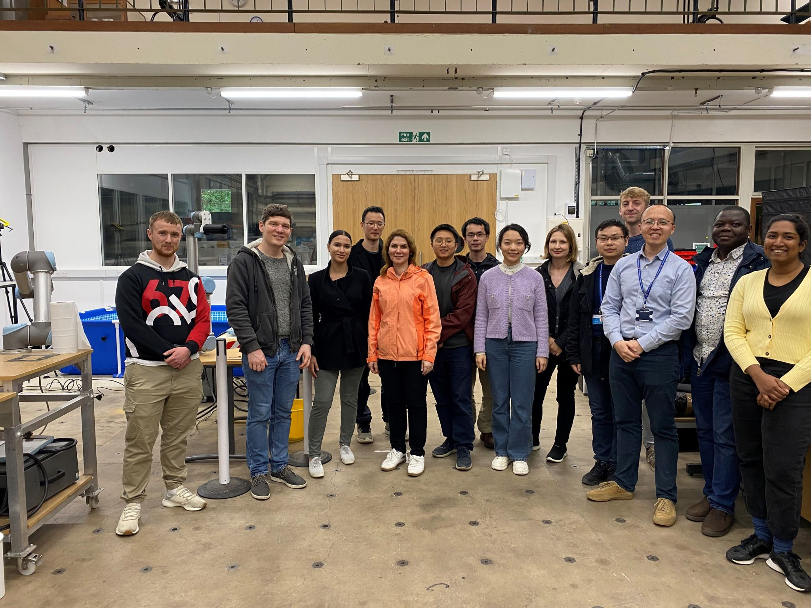
  
- **Live Morning Show Interview on Sirasa TV (Sinhalese)**: This interview was aimed at aspiring researchers and general public. During the interview I shared my life story, career as a scientist, my approach for research and the importance of asking fundamental questions.
[Watch on Youtube](https://www.youtube.com/watch?v=3APExJYP98Q&t=621s&pp=ygUQY2hhcGEgc2lyaXRodW5nZQ%3D%3D)

     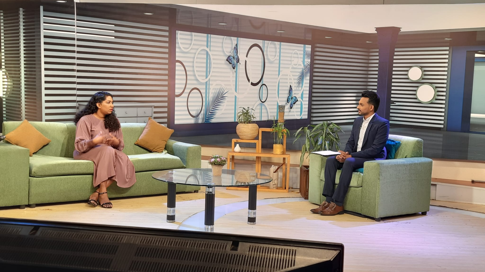

- **Taking part in policy event**: It was an amazing opportunity to learn the intersection between Science and policy at EuroScience Open Forum 2024 – MSCA Satellite Event. This was held in Katowice, Poland from June 10-11, 2024, this event brought together the MSCA research community to discuss the European research landscape.

- **Celebrating anniversary**: It was a wonderful and memorable celebration marking Prof. Fumiya Iida's 10th anniversary at the University of Cambridge, complete with cake and great company!

  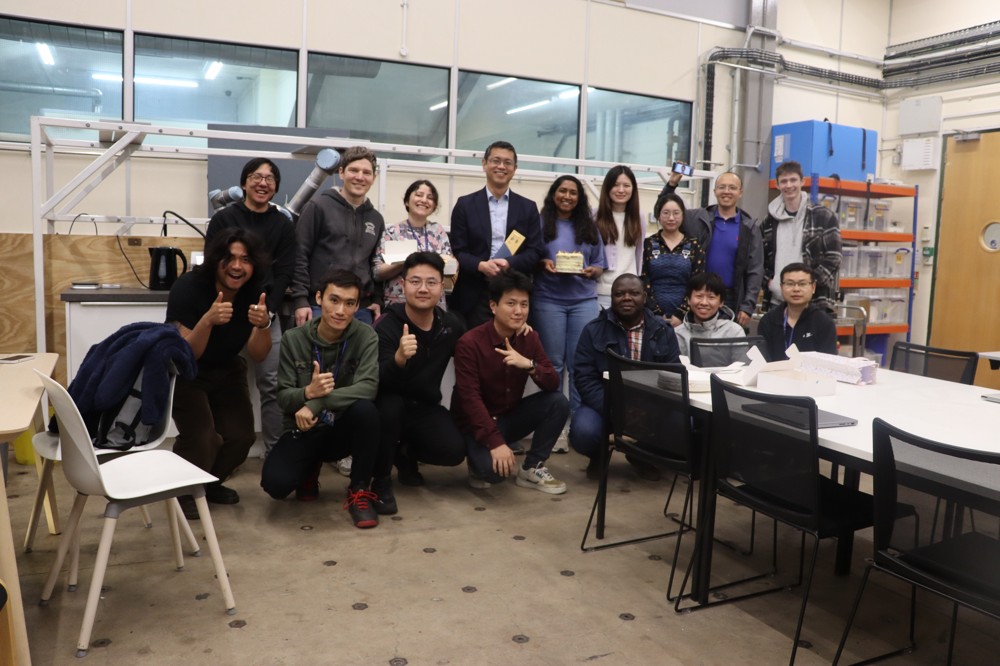

- **Future Intelligence Talk Series**: Together with my colleagues, I organise this online talk series to enhance the visibility of excellent early career researchers and disseminate state-of-the-art research work in future intelligence to enthusiasts. [Find next speaker here](https://fitalk.github.io/)
[Listen to previous talks](https://www.youtube.com/channel/UCpq_uwlsTB7fzf3CV0ctGpQ)
  
- **Science fair**: It was an incredible experience from the recent "Science is Wonderful" Science Fair organized by the Marie Curie Fund-European Union, held at Egg-Brussels. I had the fantastic opportunity to introduce young minds to the cutting-edge world of robotics through my booth, "RoboPilot Adventures". [Youtube](https://www.youtube.com/watch?v=8qk-LaSWLrU&ab_channel=BranchEducation)

  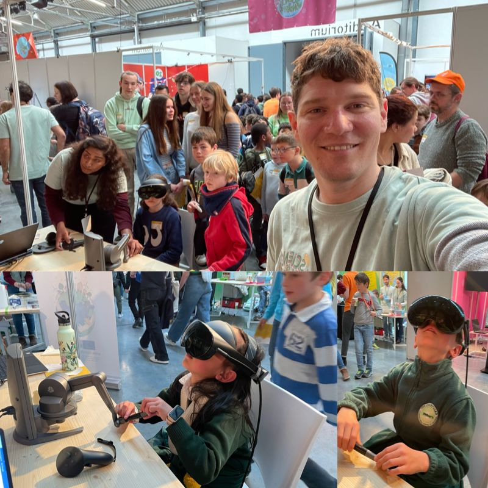
  
- **Newspaper article**: I enjoyed literature, calligraphy and writing from my childhood. I wrote my first newspaper article to Vidusara, the weekly Science magazine in Sri Lanka, on "Robotics for the changing world". This was written in Sinhalese and published in 2017 while I was in my 1st year as a PhD candidate.

  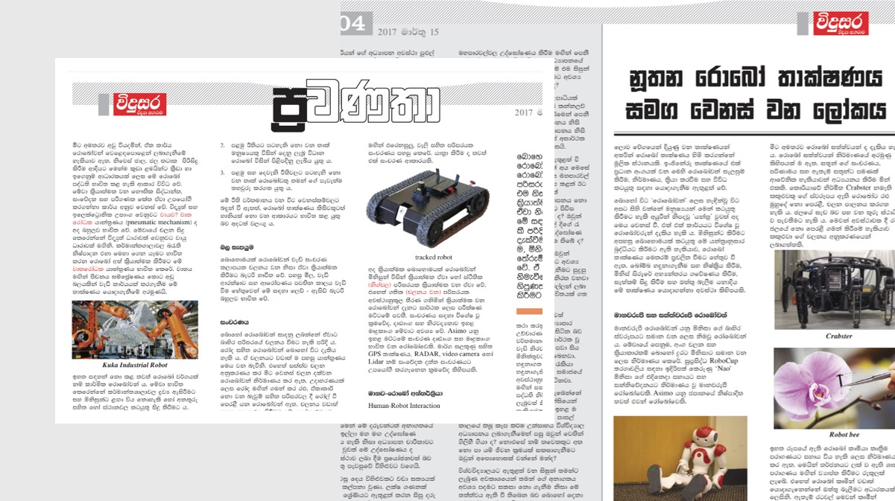

---

## Contact

I’m passionate about advancing robotics through innovative research, impactful projects, and engaging outreach. If any of these topics resonate with you—whether you’re interested in collaborating, learning more about my work, or simply discussing the future of robotics—I’d love to connect. Please feel free to reach out!

**Email**: [csh66@cam.ac.uk](mailto:csh66@cam.ac.uk)  
**LinkedIn**: [Chapa Sirithunge](https://www.linkedin.com/in/chapa-sirithunge/) 
